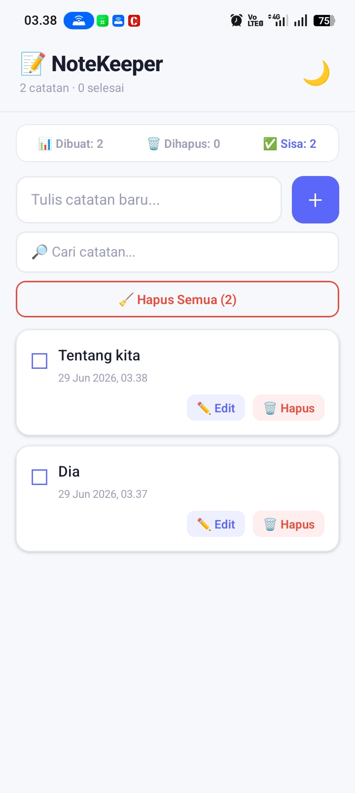
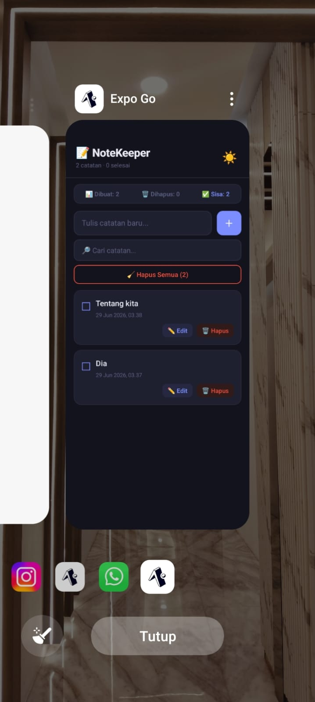
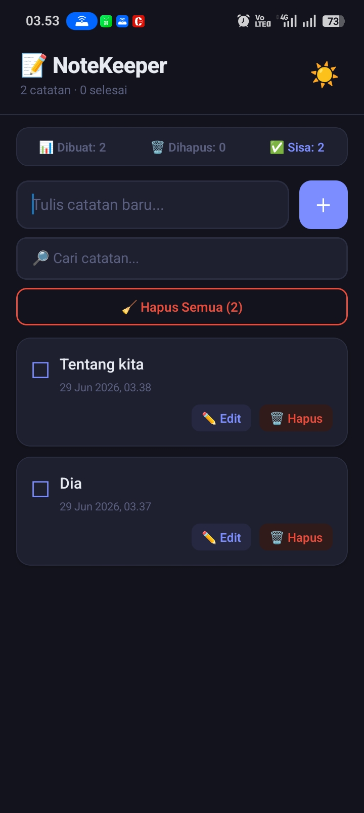

# 📝 NoteKeeper

Aplikasi catatan persisten berbasis React Native (Expo) dengan AsyncStorage.

---

## ✨ Deskripsi

NoteKeeper adalah app pencatatan mobile dengan fitur CRUD lengkap. Data tersimpan lokal menggunakan AsyncStorage — **tetap ada meskipun app ditutup total**.

---

## 📋 Fitur

### 🟢 Level 1 — Core
| Fitur | Status |
|-------|--------|
| CREATE, READ, DELETE | ✔️ |
| JSON.stringify/parse + AsyncStorage | ✔️ |
| FlatList + Empty state | ✔️ |
| Persistensi data terbukti | ✔️ |

### 🟡 Level 2 — Pengembangan (semua 6 fitur)
| Fitur | Status |
|-------|--------|
| ✏️ Edit inline | ✔️ |
| 🌙 Dark Mode tersimpan | ✔️ |
| 🔎 Search/Filter real-time | ✔️ |
| 📊 Statistik tersimpan | ✔️ |
| 🗑️ Konfirmasi hapus | ✔️ |
| 🧹 Hapus semua | ✔️ |

### 🔴 Level 3 — Bonus
| Fitur | Status |
|-------|--------|
| 🕐 Timestamp per catatan | ✔️ |
| ☑ Toggle status selesai | ✔️ |

---

## 📱 Screenshot

| Light Mode | Dark Mode |
|:---:|:---:|
|  |  |

| Sebelum Tutup App | Setelah Buka Lagi |
|:---:|:---:|
|  |  |
---

## 🚀 Cara Menjalankan

```bash
git clone https://github.com/USERNAME/notekeeper.git
cd notekeeper
npm install
npx expo start
```
Scan QR code di Expo Go → app siap digunakan.

---

## 🛠️ Tech Stack

| Teknologi | Versi |
|-----------|-------|
| React Native | 0.73 |
| Expo | ~50.0 |
| AsyncStorage | 2.2.0 |

---

## 🔗 Links

- **Expo Snack:** *(https://snack.expo.dev/@boraborii/notekeeper)*
- **Github:** *(https://github.com/rikapandia/NoteKeeper)*

---

*Misi 12: Build a Persistent App — Pemrograman Mobile*
